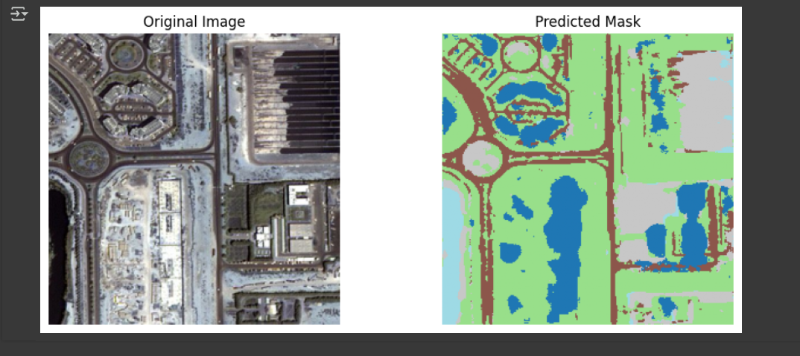

# Semantic segmentation of satellite imagery
This repository implements **semantic segmentation** on high-resolution **satellite imagery** using the **U-Net architecture**, achieving a **test accuracy of 85%**. The goal is to identify and classify different land cover types such as buildings, roads, vegetation, and more at the pixel level.

**Jupyter notebooks are not functioning on github properly currently, click the link below to biew the code**
**https://colab.research.google.com/drive/1Ax3QFJVnxTack9uojcxjwAxNvA8IP0C3?usp=sharing**

## 📂 Dataset

The dataset consists of high-resolution aerial or satellite images annotated for semantic segmentation. Each image is paired with a mask that assigns a class label to every pixel.

-   **Total Images**: 72
    
-   **Classes**: Buildings, Roads, Water, Vegetation, Bare land, and Others
    
-   **Image Format**: `.jpg` or `.png`
    
-   **Annotation Format**: RGB-encoded masks

## 🧠 Model: U-Net Architecture

U-Net is a convolutional neural network architecture originally designed for biomedical image segmentation. It has since proven highly effective in satellite imagery segmentation due to its ability to capture both low-level and high-level features.

### Key Features:

-   Encoder-Decoder structure
    
-   Skip connections for fine-grained localization
    
-   Fully convolutional for arbitrary input sizes
    

> 📖 **Reference**: [Ronneberger et al., 2015 - U-Net Paper](https://arxiv.org/abs/1505.04597)

## ✅ Results

-   **Test Accuracy**: **85%**
    
-   **Evaluation Metric**: Pixel-wise accuracy and Intersection over Union (IoU)

## 📈 Metrics

-   **Accuracy**: 85%
    
-   **Loss Function**: Categorical Cross-Entropy
    
-   **Optimizer**: Adam
